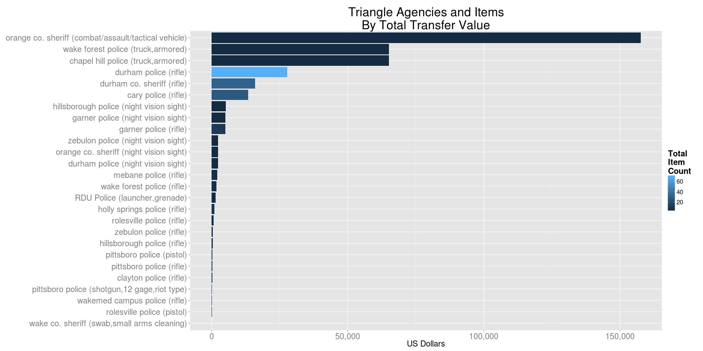

# Data Sources

The [DLA’s](http://www.dispositionservices.dla.mil/) Law Enforcement Support Office (LESO) transfers excess Department of Defense
property to federal, state, and local law enforcement agencies within the United States and its Territories

Details of transfers since 1950 have been documented on this webpage.

* [http://www.dispositionservices.dla.mil/EFOIA-Privacy/Pages/ereadingroom.aspx#1033](http://www.dispositionservices.dla.mil/EFOIA-Privacy/Pages/ereadingroom.aspx#1033)

The following files available above are used in this analysis:

|File Name                |Description                   |URL                                                                    |
|-------------------------|------------------------------|-----------------------------------------------------------------------|
|tacticalatLEAAL-LA.xls|DLA/DoD 1033 Alaska - Louisiana|http://www.dispositionservices.dla.mil/EFOIA-Privacy/Documents/tacticalatLEAAL-LA.xls|
|tacticalatLEAMA-WYandTerr.xls|DLA/DoD 1033 Massachusetts - Wyoming and territories|http://www.dispositionservices.dla.mil/EFOIA-Privacy/Documents/tacticalatLEAMA-WYandTerr.xls|

# NC

## Triangle Counties

Agencies within the following counties are included:

* Chatham
* Durham
* Orange
* Wake

### Data Summaries

<!-- html table generated in R 3.1.2 by xtable 1.7-4 package -->
<!-- Sun Dec  7 15:43:54 2014 -->
<table border=1>
<tr> <th>  </th> <th> agencyName </th> <th> shipYear </th> <th> itemName </th> <th> total </th>  </tr>
  <tr> <td align="right"> 1 </td> <td> cary police </td> <td align="right"> 2007.00 </td> <td> rifle </td> <td align="right"> 27.00 </td> </tr>
  <tr> <td align="right"> 2 </td> <td> chapel hill police </td> <td align="right"> 2012.00 </td> <td> truck,armored </td> <td align="right"> 1.00 </td> </tr>
  <tr> <td align="right"> 3 </td> <td> clayton police </td> <td align="right"> 2006.00 </td> <td> rifle </td> <td align="right"> 2.00 </td> </tr>
  <tr> <td align="right"> 4 </td> <td> durham co. sheriff </td> <td align="right"> 2007.00 </td> <td> rifle </td> <td align="right"> 28.00 </td> </tr>
  <tr> <td align="right"> 5 </td> <td> durham co. sheriff </td> <td align="right"> 2008.00 </td> <td> rifle </td> <td align="right"> 4.00 </td> </tr>
  <tr> <td align="right"> 6 </td> <td> durham police </td> <td align="right"> 1993.00 </td> <td> rifle </td> <td align="right"> 6.00 </td> </tr>
  <tr> <td align="right"> 7 </td> <td> durham police </td> <td align="right"> 1995.00 </td> <td> night vision sight </td> <td align="right"> 1.00 </td> </tr>
  <tr> <td align="right"> 8 </td> <td> durham police </td> <td align="right"> 2006.00 </td> <td> rifle </td> <td align="right"> 64.00 </td> </tr>
  <tr> <td align="right"> 9 </td> <td> garner police </td> <td align="right"> 2004.00 </td> <td> night vision sight </td> <td align="right"> 1.00 </td> </tr>
  <tr> <td align="right"> 10 </td> <td> garner police </td> <td align="right"> 2006.00 </td> <td> rifle </td> <td align="right"> 10.00 </td> </tr>
  <tr> <td align="right"> 11 </td> <td> hillsborough police </td> <td align="right"> 1993.00 </td> <td> rifle </td> <td align="right"> 3.00 </td> </tr>
  <tr> <td align="right"> 12 </td> <td> hillsborough police </td> <td align="right"> 1998.00 </td> <td> night vision sight </td> <td align="right"> 1.00 </td> </tr>
  <tr> <td align="right"> 13 </td> <td> holly springs police </td> <td align="right"> 2010.00 </td> <td> rifle </td> <td align="right"> 8.00 </td> </tr>
  <tr> <td align="right"> 14 </td> <td> mebane police </td> <td align="right"> 2006.00 </td> <td> rifle </td> <td align="right"> 4.00 </td> </tr>
  <tr> <td align="right"> 15 </td> <td> orange co. sheriff </td> <td align="right"> 1995.00 </td> <td> night vision sight </td> <td align="right"> 1.00 </td> </tr>
  <tr> <td align="right"> 16 </td> <td> orange co. sheriff </td> <td align="right"> 2003.00 </td> <td> combat/assault/tactical vehicle </td> <td align="right"> 1.00 </td> </tr>
  <tr> <td align="right"> 17 </td> <td> pittsboro police </td> <td align="right"> 1993.00 </td> <td> rifle </td> <td align="right"> 1.00 </td> </tr>
  <tr> <td align="right"> 18 </td> <td> pittsboro police </td> <td align="right"> 2008.00 </td> <td> pistol </td> <td align="right"> 5.00 </td> </tr>
  <tr> <td align="right"> 19 </td> <td> pittsboro police </td> <td align="right"> 2013.00 </td> <td> rifle </td> <td align="right"> 1.00 </td> </tr>
  <tr> <td align="right"> 20 </td> <td> pittsboro police </td> <td align="right"> 2013.00 </td> <td> shotgun,12 gage,riot type </td> <td align="right"> 2.00 </td> </tr>
  <tr> <td align="right"> 21 </td> <td> RDU Police </td> <td align="right"> 2010.00 </td> <td> launcher,grenade </td> <td align="right"> 2.00 </td> </tr>
  <tr> <td align="right"> 22 </td> <td> rolesville police </td> <td align="right"> 2008.00 </td> <td> pistol </td> <td align="right"> 1.00 </td> </tr>
  <tr> <td align="right"> 23 </td> <td> rolesville police </td> <td align="right"> 2008.00 </td> <td> rifle </td> <td align="right"> 3.00 </td> </tr>
  <tr> <td align="right"> 24 </td> <td> wake co. sheriff </td> <td align="right"> 2013.00 </td> <td> swab,small arms cleaning </td> <td align="right"> 1.00 </td> </tr>
  <tr> <td align="right"> 25 </td> <td> wake forest police </td> <td align="right"> 2006.00 </td> <td> rifle </td> <td align="right"> 1.00 </td> </tr>
  <tr> <td align="right"> 26 </td> <td> wake forest police </td> <td align="right"> 2008.00 </td> <td> rifle </td> <td align="right"> 2.00 </td> </tr>
  <tr> <td align="right"> 27 </td> <td> wake forest police </td> <td align="right"> 2010.00 </td> <td> rifle </td> <td align="right"> 1.00 </td> </tr>
  <tr> <td align="right"> 28 </td> <td> wake forest police </td> <td align="right"> 2012.00 </td> <td> truck,armored </td> <td align="right"> 1.00 </td> </tr>
  <tr> <td align="right"> 29 </td> <td> wakemed campus police </td> <td align="right"> 1993.00 </td> <td> rifle </td> <td align="right"> 1.00 </td> </tr>
  <tr> <td align="right"> 30 </td> <td> zebulon police </td> <td align="right"> 1993.00 </td> <td> rifle </td> <td align="right"> 3.00 </td> </tr>
  <tr> <td align="right"> 31 </td> <td> zebulon police </td> <td align="right"> 1995.00 </td> <td> night vision sight </td> <td align="right"> 1.00 </td> </tr>
   </table>

### Total Value of Items Transferred

 

### Itemization of Items Transferred

 

# Copying

This work is licensed under a Creative Commons Attribution-ShareAlike 4.0 International License.

Follow these links for licensing and re-use details:

* [http://creativecommons.org/licenses/by-sa/4.0/](http://creativecommons.org/licenses/by-sa/4.0/)
* [http://creativecommons.org/licenses/by-sa/4.0/legalcode](http://creativecommons.org/licenses/by-sa/4.0/legalcode)

# Adapting

This work is available on [GitHub](http://github.com) at the following URL:

* [https://github.com/danielschudel/TenThirtyThree/](https://github.com/danielschudel/TenThirtyThree/)
