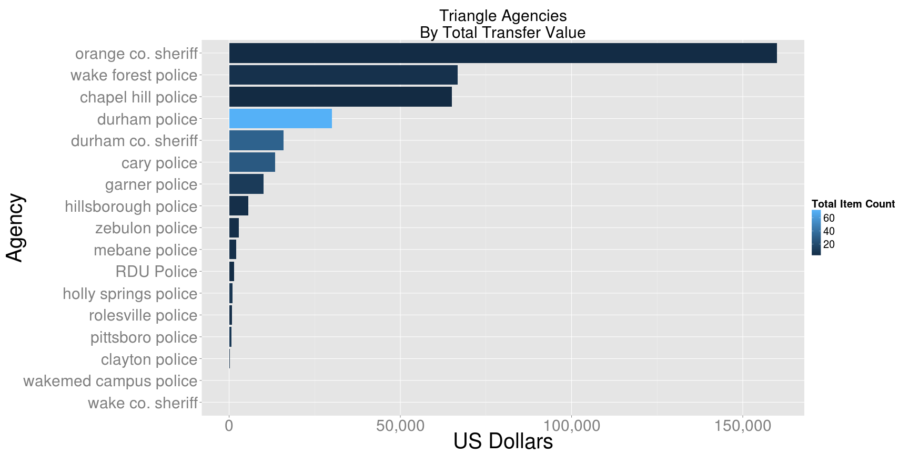

# NC

## Triangle Counties

Agencies within the following counties are included:

* Chatham
* Durham
* Orange
* Wake

### Total Value of Items Transferred

 

### Itemization of Items Transferred

 
